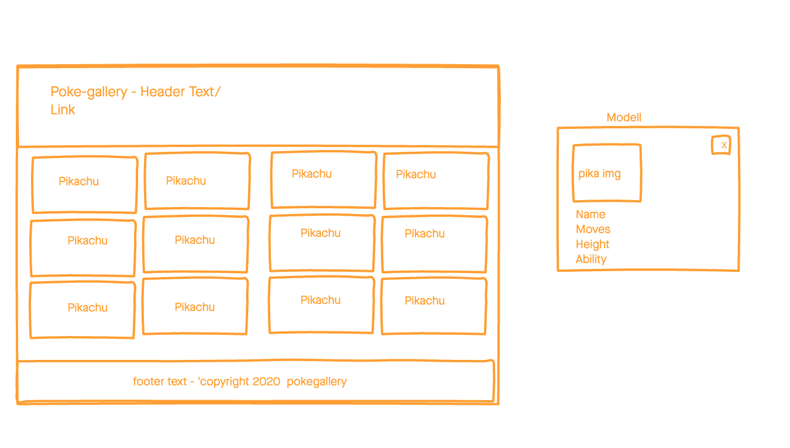

# Pokegallery

A simple web appplication that displays Pokemon data using the Pokemon API

##Technologies

-HTML5
-CSS3
-JavaScript
-jQuery
-Google Fonts
-jQuery Modal
-Pokemon API

## Wire Frame

## Getting Started
[Click Here](https://peterwgacek.github.io/pokegallery/) to see the deployed app!

## Future Enhancements
-The ability to favorite and save Pokemon to local storage